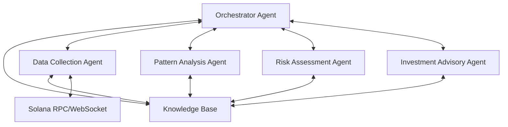

# System Patterns

## System Architecture

The Solana Token Analysis Agent Swarm implements a multi-agent architecture with message-based communication. The system follows a decentralized collaborative model where specialized agents perform distinct tasks while sharing information through a central knowledge base.

### Component Layers

1. **Core Infrastructure Layer**
   - Base Agent implementation
   - Message passing system
   - Agent lifecycle management
   - Orchestration capabilities

2. **Data Collection Layer**
   - Solana blockchain connectivity
   - Token event monitoring
   - Transaction data collection
   - Data normalization and preprocessing

3. **Analysis Layer**
   - Pattern recognition
   - Risk assessment
   - Historical comparison
   - Signal generation

4. **Advisory Layer**
   - Opportunity scoring
   - Investment recommendation generation
   - Risk/reward calculation
   - Report generation

5. **User Interface Layer**
   - Command-line interface
   - Query handling
   - Results formatting
   - Configuration management

## Key Technical Decisions

### 1. Asynchronous Communication Architecture

The system uses an asynchronous message-passing architecture implemented with Python's `asyncio`. This decision was made to:
- Handle high-volume data streams efficiently
- Allow agents to work independently at their own pace
- Enable non-blocking operations for real-time monitoring
- Support dynamic scaling of agent instances

### 2. Agent Base Class Hierarchy

A common base `Agent` class was developed to:
- Standardize agent interfaces and lifecycle management
- Provide consistent message handling capabilities
- Implement common monitoring and status reporting
- Simplify the creation of new specialized agents

### 3. Centralized Orchestration with Decentralized Processing

The `OrchestratorAgent` manages the overall system but doesn't centralize processing:
- Agents register with the orchestrator but operate independently
- The orchestrator handles routing and lifecycle management
- Processing logic remains distributed among specialized agents
- This balance enables both coordination and performance scaling

### 4. Type-based Message Routing

Messages are typed (Command, Data, Query, etc.) to enable:
- Efficient routing based on message content
- Standardized handling patterns
- Clear separation of concerns
- Extensible communication patterns

## Design Patterns in Use

### 1. Observer Pattern
- Agents can subscribe to specific event types
- The Data Collection Agent acts as a subject, notifying interested observers
- Enables selective processing based on agent interests

### 2. Command Pattern
- Commands are encapsulated as message objects
- Each command has a specific handler
- Command execution is decoupled from command issuance

### 3. Strategy Pattern
- Different analysis strategies are encapsulated in specialized agents
- Strategies can be swapped or extended without changing the core system
- Enables introducing new analysis techniques as plugins

### 4. Mediator Pattern
- The Orchestrator acts as a mediator between agents
- Reduces direct dependencies between component agents
- Centralizes complex coordination logic

### 5. Registry Pattern
- Agents register capabilities and status with the orchestrator
- Enables dynamic discovery of available services
- Supports runtime configuration of processing pipelines

## Component Relationships

### Agent Base → Specialized Agents
- All specialized agents inherit from the `Agent` base class
- Common functionality for messaging, lifecycle, and status reporting
- Specialized agents implement type-specific business logic

### Orchestrator Agent → Agent Registry
- Maintains registry of all active agents
- Handles agent lifecycle (start, stop, pause)
- Routes messages between agents
- Monitors system health

### Data Collection Agent → External APIs
- Connects to Solana RPC and WebSocket services
- Implements retry and resilience patterns
- Normalizes blockchain data for internal consumption

### Knowledge Base → Analysis Agents
- Central repository for shared token data
- Provides both raw and processed data
- Supports querying by different criteria
- Maintains historical context for analysis

### Analysis Agent → Investment Advisory Agent
- Analysis results flow to the advisory agent
- Advisory agent aggregates multiple signals
- Combines pattern and risk data for holistic assessment
- Generates actionable recommendations
