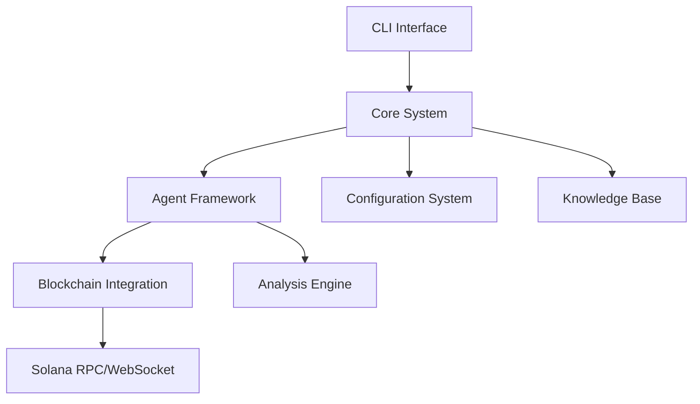

# Technical Context

## Technologies Used

### Core Technologies

- **Python 3.8+**: Primary development language
- **asyncio**: Asynchronous I/O framework for non-blocking operations
- **Solana RPC/WebSocket APIs**: For blockchain data access
- **JSON**: Used for configuration and data exchange

### Key Libraries

- **loguru**: Advanced logging system
- **typing**: Type annotations for improved code quality
- **uuid**: For unique ID generation
- **abc**: For abstract base classes and interfaces

### Development Tools

- **pip**: Package management
- **Git**: Version control
- **JSON**: Configuration files

## Development Setup

### Environment Requirements

- Python 3.8 or higher
- Solana RPC/WebSocket access
- API keys for external services (if applicable)

### Installation Process

1. Clone repository
2. Install dependencies via pip:
   ```bash
   pip install -r requirements.txt
   ```
3. Create default configuration:
   ```bash
   python src/cli.py --create-config
   ```
4. Configure Solana RPC endpoints in config.json

### Development Environment

- Standard Python development environment
- Environment variables with `SOLANA_SWARM_` prefix can override config values
- Logging configured via loguru with runtime levels

## Technical Constraints

### Performance Considerations

- **Real-time Processing**: Must handle blockchain data streams with minimal latency
- **Memory Management**: Efficient storage of token and transaction data
- **Concurrent Operations**: Support for multiple simultaneous analyses
- **Scalability**: Ability to handle growing number of tokens and transactions

### Security Constraints

- **API Key Protection**: Secure storage of Solana RPC credentials
- **Data Validation**: Verification of incoming blockchain data
- **Error Handling**: Graceful recovery from network or API failures
- **Safe Operations**: Non-destructive, read-only blockchain interactions

### Integration Constraints

- **Solana API Compatibility**: Must adapt to Solana RPC API changes
- **Version Dependencies**: Python package version requirements
- **Configuration Flexibility**: Support for different deployment environments
- **Extension Points**: Clean interfaces for adding new agents or analysis methods

## Dependencies

### External Dependencies

- **Solana Blockchain**: Primary data source
  - RPC API for queries
  - WebSocket API for real-time events

- **Python Ecosystem**:
  - Core libraries for async processing
  - Typing system for code quality
  - Logging infrastructure

### Internal Dependencies

#### Core Components

- **agent_base.py**: Foundation for all agent implementations
  - Provides messaging infrastructure
  - Implements lifecycle management
  - Defines abstract interfaces

- **orchestrator_agent.py**: Central coordination system
  - Manages agent registry
  - Handles message routing
  - Controls agent lifecycle

- **knowledge_base.py**: Shared data repository
  - Stores token information
  - Caches analysis results
  - Provides query capabilities

#### Specialized Agents

- **data_collection_agent.py**: Blockchain data acquisition
- **pattern_analysis_agent.py**: Trading pattern detection
- **risk_assessment_agent.py**: Token risk evaluation
- **investment_advisory_agent.py**: Recommendation generation

#### Support Systems

- **config_manager.py**: Configuration handling
- **cli.py**: Command-line interface
- **main.py**: Application entry point

## Technical Architecture Layers



## Development Workflow

1. **Setup**: Initialize development environment with dependencies
2. **Configuration**: Set up Solana RPC endpoints and API keys
3. **Development**: Implement new features or improvements
   - Follow existing patterns and base classes
   - Maintain asynchronous design principles
   - Use type annotations consistently
4. **Testing**: Verify functionality with test tokens and transactions
5. **Deployment**: Package for distribution
