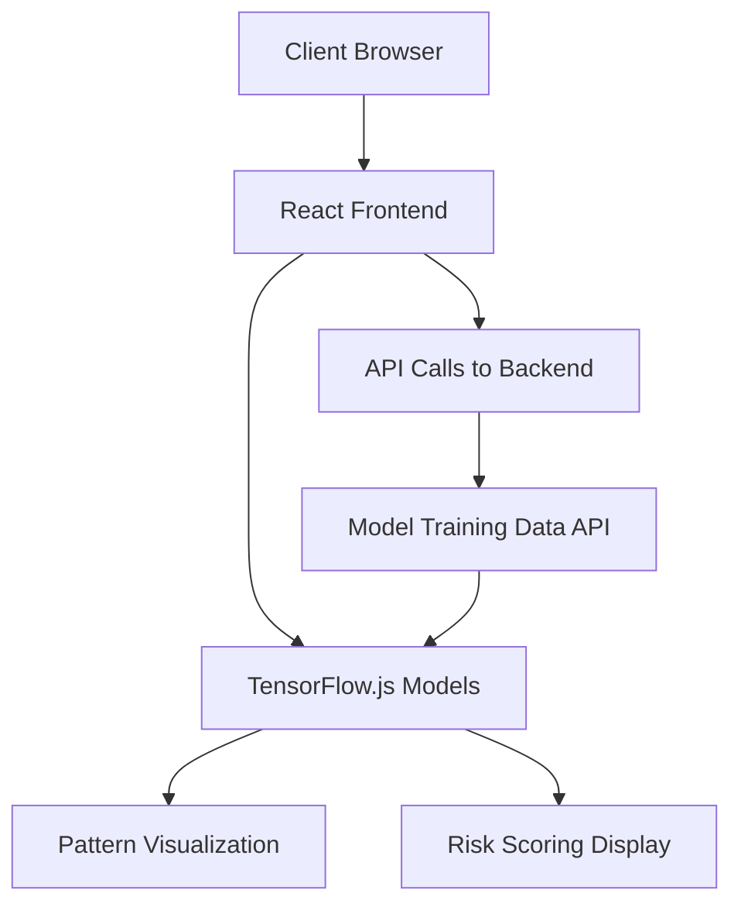

# Implementation Plan: Additional Tools & Libraries Integration

This document outlines the strategy for integrating the requested additional tools and libraries into the Solana Token Analysis Agent Swarm system.

## 1. Analytics & Machine Learning Integration

### TensorFlow.js Implementation
**Purpose**: Browser-based pattern recognition models for the React frontend dashboard.

**Implementation Strategy**:


**Steps**:
1. Create `frontend/models/` directory for TensorFlow.js model definitions
2. Implement model loading and inference pipeline in `frontend/services/model-service.js`
3. Add API endpoint in backend to serve training data for browser-based learning
4. Create visualization components that leverage model outputs

### scikit-learn Integration
**Purpose**: Statistical analysis for token pattern detection and risk assessment.

**Implementation Strategy**:
```python
# Example implementation in pattern_analysis_agent.py
from sklearn.ensemble import RandomForestClassifier, IsolationForest
from sklearn.cluster import DBSCAN
import numpy as np

class PatternAnalysisUtils:
    def __init__(self):
        self.anomaly_detector = IsolationForest(contamination=0.05)
        self.pattern_classifier = RandomForestClassifier()
        self.cluster_analyzer = DBSCAN(eps=0.3, min_samples=10)
        
    async def train_models(self, historical_data):
        # Extract features from historical data
        features = self._extract_features(historical_data)
        
        # Train anomaly detection model
        self.anomaly_detector.fit(features)
        
        # Train pattern classifier with labeled data if available
        if 'labels' in historical_data:
            self.pattern_classifier.fit(features, historical_data['labels'])
            
        # Cluster token behaviors
        self.cluster_analyzer.fit(features)
        
    def _extract_features(self, historical_data):
        # Feature extraction logic
        # Example: volume patterns, price movements, holder changes
        pass
        
    async def detect_anomalies(self, token_data):
        features = self._extract_features([token_data])
        anomaly_scores = self.anomaly_detector.decision_function(features)
        return {'anomaly_score': float(anomaly_scores[0])}
        
    async def classify_pattern(self, token_data):
        features = self._extract_features([token_data])
        pattern_probabilities = self.pattern_classifier.predict_proba(features)
        return {
            'pattern_type': self.pattern_classifier.classes_[np.argmax(pattern_probabilities)],
            'confidence': float(np.max(pattern_probabilities))
        }
```

**Steps**:
1. Add scikit-learn to `requirements.txt`
2. Create utility classes for different ML tasks:
   - `PatternAnalysisUtils` - Pattern recognition and classification
   - `RiskModelUtils` - Risk scoring using statistical models
   - `AnomalyDetectionUtils` - Detecting unusual token behavior
3. Integrate with the Pattern Analysis Agent and Risk Assessment Agent
4. Add model persistence and versioning capabilities

### PyTorch Integration
**Purpose**: Deep learning for complex pattern recognition on historical token data.

**Implementation Strategy**:
```python
# Example implementation for deep learning token pattern recognition
import torch
import torch.nn as nn
import torch.optim as optim
from torch.utils.data import DataLoader, TensorDataset

class TokenPatternRNN(nn.Module):
    def __init__(self, input_size, hidden_size, num_layers, output_size):
        super(TokenPatternRNN, self).__init__()
        self.hidden_size = hidden_size
        self.num_layers = num_layers
        self.lstm = nn.LSTM(input_size, hidden_size, num_layers, batch_first=True)
        self.fc = nn.Linear(hidden_size, output_size)
        
    def forward(self, x):
        h0 = torch.zeros(self.num_layers, x.size(0), self.hidden_size).to(x.device)
        c0 = torch.zeros(self.num_layers, x.size(0), self.hidden_size).to(x.device)
        out, _ = self.lstm(x, (h0, c0))
        out = self.fc(out[:, -1, :])
        return out

class DeepLearningManager:
    def __init__(self, input_size=10, hidden_size=50, num_layers=2, output_size=5):
        self.device = torch.device('cuda' if torch.cuda.is_available() else 'cpu')
        self.model = TokenPatternRNN(input_size, hidden_size, num_layers, output_size).to(self.device)
        self.optimizer = optim.Adam(self.model.parameters(), lr=0.001)
        self.criterion = nn.CrossEntropyLoss()
        
    async def train(self, features, labels, epochs=100, batch_size=64):
        # Convert to PyTorch tensors
        X = torch.tensor(features, dtype=torch.float32).to(self.device)
        y = torch.tensor(labels, dtype=torch.long).to(self.device)
        
        # Create DataLoader
        dataset = TensorDataset(X, y)
        data_loader = DataLoader(dataset, batch_size=batch_size, shuffle=True)
        
        # Training loop
        for epoch in range(epochs):
            for X_batch, y_batch in data_loader:
                # Forward pass
                outputs = self.model(X_batch)
                loss = self.criterion(outputs, y_batch)
                
                # Backward and optimize
                self.optimizer.zero_grad()
                loss.backward()
                self.optimizer.step()
        
    async def predict(self, features):
        self.model.eval()
        with torch.no_grad():
            X = torch.tensor(features, dtype=torch.float32).to(self.device)
            outputs = self.model(X)
            _, predicted = torch.max(outputs.data, 1)
            return predicted.cpu().numpy()
            
    async def save_model(self, path):
        torch.save({
            'model_state_dict': self.model.state_dict(),
            'optimizer_state_dict': self.optimizer.state_dict(),
        }, path)
        
    async def load_model(self, path):
        checkpoint = torch.load(path)
        self.model.load_state_dict(checkpoint['model_state_dict'])
        self.optimizer.load_state_dict(checkpoint['optimizer_state_dict'])
```

**Steps**:
1. Add PyTorch to `requirements.txt`
2. Create `core/deep_learning/` module with model definitions:
   - Time series models for token price/volume prediction
   - Classification models for pattern recognition
   - Anomaly detection models for scam identification
3. Implement model training, validation, and inference pipelines
4. Set up persistence and versioning for trained models
5. Create API endpoints to serve model predictions

## 2. Solana Ecosystem Integration

### Helius API Integration
**Purpose**: Enriched transaction data and NFT metadata for comprehensive token analysis.

**Implementation Strategy**:
```python
# Example integration in data_collection_agent.py
import aiohttp

class HeliusAPIClient:
    def __init__(self, api_key, base_url="https://api.helius.xyz/v0"):
        self.api_key = api_key
        self.base_url = base_url
        self.session = None
        
    async def initialize(self):
        self.session = aiohttp.ClientSession()
        
    async def cleanup(self):
        if self.session:
            await self.session.close()
            
    async def get_enriched_transaction(self, signature):
        """Get enriched transaction data from Helius API."""
        if not self.session:
            await self.initialize()
            
        url = f"{self.base_url}/transactions"
        params = {
            "api-key": self.api_key,
            "commitment": "confirmed"
        }
        
        payload = {
            "transactions": [signature]
        }
        
        async with self.session.post(url, json=payload, params=params) as response:
            if response.status == 200:
                return await response.json()
            else:
                error_text = await response.text()
                raise Exception(f"Helius API error ({response.status}): {error_text}")
                
    async def get_token_metadata(self, token_address):
        """Get token metadata from Helius API."""
        if not self.session:
            await self.initialize()
            
        url = f"{self.base_url}/tokens"
        params = {
            "api-key": self.api_key
        }
        
        payload = {
            "mintAccounts": [token_address]
        }
        
        async with self.session.post(url, json=payload, params=params) as response:
            if response.status == 200:
                data = await response.json()
                return data[0] if data else None
            else:
                error_text = await response.text()
                raise Exception(f"Helius API error ({response.status}): {error_text}")
                
    async def get_token_holders(self, token_address):
        """Get token holders from Helius API."""
        if not self.session:
            await self.initialize()
            
        url = f"{self.base_url}/tokens/holders"
        params = {
            "api-key": self.api_key
        }
        
        payload = {
            "mintAccount": token_address
        }
        
        async with self.session.post(url, json=payload, params=params) as response:
            if response.status == 200:
                return await response.json()
            else:
                error_text = await response.text()
                raise Exception(f"Helius API error ({response.status}): {error_text}")
```

**Steps**:
1. Create dedicated clients for Helius API:
   - `HeliusAPIClient` for generic Helius API access
   - `HeliusTransactionEnricher` for enhanced transaction analysis
   - `HeliusTokenMetadataClient` for token data
2. Integrate with `DataCollectionAgent` for enhanced token metadata
3. Add webhook support for real-time transaction monitoring
4. Create data normalization layer to standardize across APIs

### Jupiter Aggregator Integration
**Purpose**: Comprehensive DEX liquidity data for accurate market analysis.

**Implementation Strategy**:
```python
# Example implementation for Jupiter liquidity analysis
import aiohttp

class JupiterAggregatorClient:
    def __init__(self, base_url="https://quote-api.jup.ag/v6"):
        self.base_url = base_url
        self.session = None
        
    async def initialize(self):
        self.session = aiohttp.ClientSession()
        
    async def cleanup(self):
        if self.session:
            await self.session.close()
            
    async def get_quote(self, input_mint, output_mint, amount, slippage_bps=50):
        """Get a swap quote from Jupiter."""
        if not self.session:
            await self.initialize()
            
        url = f"{self.base_url}/quote"
        params = {
            "inputMint": input_mint,
            "outputMint": output_mint,
            "amount": str(amount),
            "slippageBps": slippage_bps
        }
        
        async with self.session.get(url, params=params) as response:
            if response.status == 200:
                return await response.json()
            else:
                error_text = await response.text()
                raise Exception(f"Jupiter API error ({response.status}): {error_text}")
                
    async def get_token_price(self, token_address, vs_token="EPjFWdd5AufqSSqeM2qN1xzybapC8G4wEGGkZwyTDt1v"):
        """Get token price in USD (using USDC as reference)."""
        try:
            # Use small amount for price check to minimize slippage impact
            quote = await self.get_quote(token_address, vs_token, 1000000)  # 1 token with 6 decimals
            
            if not quote or "outAmount" not in quote:
                return None
                
            # Calculate price based on the output amount
            # Assuming vs_token is USDC with 6 decimals
            price = int(quote["outAmount"]) / 1000000
            
            return {
                "price": price,
                "price_impact": quote.get("priceImpactPct", 0),
                "route_count": len(quote.get("routesInfos", [])),
                "best_route": quote.get("routePlan", [])[0].get("swapInfo", {}).get("label", "") if quote.get("routePlan") else ""
            }
        except Exception as e:
            logger.error(f"Error getting token price from Jupiter: {str(e)}")
            return None
            
    async def analyze_liquidity_depth(self, token_address, vs_token="EPjFWdd5AufqSSqeM2qN1xzybapC8G4wEGGkZwyTDt1v"):
        """Analyze liquidity depth by testing multiple trade sizes."""
        amounts = [100000000, 1000000000, 10000000000, 100000000000]  # 100, 1000, 10000, 100000 tokens
        results = []
        
        for amount in amounts:
            try:
                quote = await self.get_quote(token_address, vs_token, amount)
                if quote:
                    results.append({
                        "input_amount": amount / 1000000,  # Convert to human-readable amount
                        "output_amount": int(quote.get("outAmount", 0)) / 1000000,
                        "price_impact_percent": quote.get("priceImpactPct", 0) * 100,
                        "routes_available": len(quote.get("routesInfos", []))
                    })
            except Exception as e:
                logger.error(f"Error analyzing depth at amount {amount}: {str(e)}")
                break
                
        # Calculate estimated liquidity from price impact
        total_liquidity = 0
        if results:
            # Use the largest trade with acceptable price impact to estimate liquidity
            for result in results:
                impact = result.get("price_impact_percent", 0)
                if impact > 0 and impact < 10:  # Use trades with less than 10% impact
                    liquidity = result.get("input_amount", 0) / impact * 100
                    if liquidity > total_liquidity:
                        total_liquidity = liquidity
        
        return {
            "slippage_data": results,
            "estimated_liquidity_usd": total_liquidity,
            "max_trade_size": max([r.get("input_amount", 0) for r in results]) if results else 0
        }
```

**Steps**:
1. Create `JupiterAggregatorClient` for interacting with Jupiter API
2. Enhance `TokenMetricsCollector` with Jupiter integration:
   - Use Jupiter for more accurate price data
   - Implement liquidity depth analysis
   - Create multi-DEX routing analysis
3. Add token swap simulation for price impact testing
4. Implement historical price and liquidity tracking

### Switchboard Integration
**Purpose**: Oracle data feeds and price information for verified token data.

**Implementation Strategy**:
```typescript
// Example implementation for Switchboard integration
import { Connection, PublicKey } from '@solana/web3.js';
import { AggregatorAccount, SwitchboardProgram } from '@switchboard-xyz/solana.js';

export class SwitchboardClient {
  private connection: Connection;
  private program: SwitchboardProgram;

  constructor(rpcEndpoint: string) {
    this.connection = new Connection(rpcEndpoint, 'confirmed');
  }

  async initialize() {
    this.program = await SwitchboardProgram.load(this.connection);
  }

  async getPriceFeed(feedAddress: string): Promise<number | null> {
    try {
      const feedPubkey = new PublicKey(feedAddress);
      const aggregatorAccount = new AggregatorAccount({
        program: this.program,
        publicKey: feedPubkey,
      });
      
      const result = await aggregatorAccount.fetchLatestValue();
      if (result === null) {
        console.error('No result found for feed', feedAddress);
        return null;
      }
      
      return result;
    } catch (error) {
      console.error('Error fetching Switchboard price feed:', error);
      return null;
    }
  }

  async getTokenPrice(tokenSymbol: string): Promise<number | null> {
    // Map of token symbols to their respective Switchboard feed addresses
    const feedMap: Record<string, string> = {
      'BTC': 'GVXRSBjFk6e6J3NbVPXohDJetcTjaeeuykUpbQF8UoMU',
      'ETH': '5zxs8uhiUxwHHLrUf6Pu6nHrbB8X8KyfFUnxcw8RpxJP',
      'SOL': 'GvDMxPzN1sCj7L26YDK2HnMRXEQmQ2aemov8YBtPS7vR',
      // Add more mappings as needed
    };
    
    const feedAddress = feedMap[tokenSymbol.toUpperCase()];
    if (!feedAddress) {
      console.warn(`No Switchboard feed configured for token ${tokenSymbol}`);
      return null;
    }
    
    return this.getPriceFeed(feedAddress);
  }
}
```

**Implementation as MCP Server**:
```typescript
// Example implementation as MCP server
import { Server } from '@modelcontextprotocol/sdk/server/index.js';
import { StdioServerTransport } from '@modelcontextprotocol/sdk/server/stdio.js';
import {
  CallToolRequestSchema,
  ErrorCode,
  ListResourcesRequestSchema,
  ListToolsRequestSchema,
  McpError,
} from '@modelcontextprotocol/sdk/types.js';
import { Connection, PublicKey } from '@solana/web3.js';
import { AggregatorAccount, SwitchboardProgram } from '@switchboard-xyz/solana.js';

const SWITCHBOARD_FEEDS = {
  'BTC/USD': 'GVXRSBjFk6e6J3NbVPXohDJetcTjaeeuykUpbQF8UoMU',
  'ETH/USD': '5zxs8uhiUxwHHLrUf6Pu6nHrbB8X8KyfFUnxcw8RpxJP',
  'SOL/USD': 'GvDMxPzN1sCj7L26YDK2HnMRXEQmQ2aemov8YBtPS7vR',
};

class SwitchboardServer {
  private server: Server;
  private connection: Connection;
  private program: SwitchboardProgram | null = null;

  constructor() {
    this.server = new Server(
      {
        name: 'switchboard-oracle-server',
        version: '0.1.0',
      },
      {
        capabilities: {
          resources: {},
          tools: {},
        },
      }
    );

    this.connection = new Connection(process.env.SOLANA_RPC_URL || 'https://api.mainnet-beta.solana.com', 'confirmed');
    
    this.setupToolHandlers();
    
    // Error handling
    this.server.onerror = (error) => console.error('[MCP Error]', error);
    process.on('SIGINT', async () => {
      await this.server.close();
      process.exit(0);
    });
  }

  private setupToolHandlers() {
    this.server.setRequestHandler(ListToolsRequestSchema, async () => ({
      tools: [
        {
          name: 'get_price_feed',
          description: 'Get latest price data from Switchboard oracle feed',
          inputSchema: {
            type: 'object',
            properties: {
              feed_identifier: {
                type: 'string',
                description: 'Feed identifier (e.g., "SOL/USD", or feed address)',
              },
            },
            required: ['feed_identifier'],
          },
        },
        {
          name: 'get_multiple_prices',
          description: 'Get latest prices for multiple tokens',
          inputSchema: {
            type: 'object',
            properties: {
              feed_identifiers: {
                type: 'array',
                items: {
                  type: 'string',
                },
                description: 'Array of feed identifiers',
              },
            },
            required: ['feed_identifiers'],
          },
        },
      ],
    }));

    this.server.setRequestHandler(CallToolRequestSchema, async (request) => {
      if (!this.program) {
        try {
          this.program = await SwitchboardProgram.load(this.connection);
        } catch (error) {
          throw new McpError(
            ErrorCode.InternalError,
            `Failed to initialize Switchboard program: ${error}`
          );
        }
      }
      
      if (request.params.name === 'get_price_feed') {
        return this.handleGetPriceFeed(request.params.arguments);
      } else if (request.params.name === 'get_multiple_prices') {
        return this.handleGetMultiplePrices(request.params.arguments);
      }
      
      throw new McpError(
        ErrorCode.MethodNotFound,
        `Unknown tool: ${request.params.name}`
      );
    });
  }
  
  private async handleGetPriceFeed(args: any) {
    if (!args.feed_identifier) {
      throw new McpError(
        ErrorCode.InvalidParams,
        'Missing feed_identifier parameter'
      );
    }
    
    try {
      let feedAddress = args.feed_identifier;
      
      // Check if the input is a known token pair
      if (SWITCHBOARD_FEEDS[feedAddress]) {
        feedAddress = SWITCHBOARD_FEEDS[feedAddress];
      }
      
      // Verify it's a valid public key
      let feedPubkey: PublicKey;
      try {
        feedPubkey = new PublicKey(feedAddress);
      } catch (e) {
        throw new McpError(
          ErrorCode.InvalidParams,
          `Invalid feed address: ${feedAddress}`
        );
      }
      
      const aggregatorAccount = new AggregatorAccount({
        program: this.program!,
        publicKey: feedPubkey,
      });
      
      const result = await aggregatorAccount.fetchLatestValue();
      if (result === null) {
        return {
          content: [
            {
              type: 'text',
              text: JSON.stringify({ error: 'No value available for feed' }, null, 2),
            },
          ],
          isError: true,
        };
      }
      
      const metadata = await aggregatorAccount.loadData();
      
      return {
        content: [
          {
            type: 'text',
            text: JSON.stringify({
              feed: feedAddress,
              price: result.toString(),
              decimals: metadata.decimals,
              lastUpdatedTimestamp: new Date(metadata.latestConfirmedRound.roundOpenTimestamp.toNumber() * 1000).toISOString(),
            }, null, 2),
          },
        ],
      };
    } catch (error) {
      return {
        content: [
          {
            type: 'text',
            text: `Error fetching price feed: ${error}`,
          },
        ],
        isError: true,
      };
    }
  }
  
  private async handleGetMultiplePrices(args: any) {
    if (!args.feed_identifiers || !Array.isArray(args.feed_identifiers)) {
      throw new McpError(
        ErrorCode.InvalidParams,
        'Missing or invalid feed_identifiers parameter'
      );
    }
    
    try {
      const results = await Promise.all(
        args.feed_identifiers.map(async (identifier: string) => {
          try {
            let feedAddress = identifier;
            
            // Check if the input is a known token pair
            if (SWITCHBOARD_FEEDS[identifier]) {
              feedAddress = SWITCHBOARD_FEEDS[identifier];
            }
            
            const feedPubkey = new PublicKey(feedAddress);
            const aggregatorAccount = new AggregatorAccount({
              program: this.program!,
              publicKey: feedPubkey,
            });
            
            const result = await aggregatorAccount.fetchLatestValue();
            if (result === null) {
              return {
                feed: identifier,
                error: 'No value available',
              };
            }
            
            const metadata = await aggregatorAccount.loadData();
            
            return {
              feed: identifier,
              price: result.toString(),
              decimals: metadata.decimals,
              lastUpdatedTimestamp: new Date(metadata.latestConfirmedRound.roundOpenTimestamp.toNumber() * 1000).toISOString(),
            };
          } catch (e) {
            return {
              feed: identifier,
              error: `Error: ${e}`,
            };
          }
        })
      );
      
      return {
        content: [
          {
            type: 'text',
            text: JSON.stringify(results, null, 2),
          },
        ],
      };
    } catch (error) {
      return {
        content: [
          {
            type: 'text',
            text: `Error fetching multiple prices: ${error}`,
          },
        ],
        isError: true,
      };
    }
  }

  async run() {
    const transport = new StdioServerTransport();
    await this.server.connect(transport);
    console.error('Switchboard oracle MCP server running on stdio');
  }
}

const server = new SwitchboardServer();
server.run().catch(console.error);
```

**Steps**:
1. Create `SwitchboardClient` for oracle data interactions
2. Implement as MCP server for cross-language access
3. Integrate price feed data into token analysis
4. Use oracle data for verifying market data from other sources
5. Create confidence scoring based on oracle data freshness

### SPL Token Integration
**Purpose**: Token standard compliance checking for security verification.

**Implementation Strategy**:
```typescript
// Example implementation for SPL token standard compliance checking
import { Connection, PublicKey } from '@solana/web3.js';
import { TOKEN_PROGRAM_ID, Token, AccountLayout } from '@solana/spl-token';

export class SPLTokenChecker {
  private connection: Connection;

  constructor(rpcEndpoint: string) {
    this.connection = new Connection(rpcEndpoint, 'confirmed');
  }

  async checkTokenCompliance(tokenAddress: string): Promise<{
    isCompliant: boolean;
    issues: string[];
    details: any;
  }> {
    try {
      const mintPubkey = new PublicKey(tokenAddress);
      const issues: string[] = [];

      // Check if the token exists
      const mintInfo = await this.connection.getAccountInfo(mintPubkey);
      if (!mintInfo) {
        return {
          isCompliant: false,
          issues: ['Token mint account does not exist'],
          details: {}
        };
      }

      // Check if owned by the token program
      if (!mintInfo.owner.equals(TOKEN_PROGRAM_ID)) {
        issues.push('Token mint not owned by SPL Token program');
      }

      // Parse mint data
      const data = Buffer.from(mintInfo.data);
      const mintState = AccountLayout.decode(data);

      // Additional compliance checks
      const details: any = {
        mint: tokenAddress,
        decimals: mintState.decimals,
        supply: mintState.supply.toString(),
        isInitialized: mintState.state !== 0,
        freezeAuthority: mintState.freezeAuthority ? new PublicKey(mintState.freezeAuthority).toString() : null,
        mintAuthority: mintState.mintAuthority ? new PublicKey(mintState.mintAuthority).toString() : null
      };

      // Check if initialized
      if (mintState.state === 0) {
        issues.push('Token mint is not initialized');
      }

      // Check authorities
      if (mintState.freezeAuthority) {
        // Having a freeze authority is not non-compliant, but worth noting
        details.hasFreezeAuthority = true;
      }

      if (mintState.mintAuthority) {
        // Having a mint authority means supply can be increased
        details.hasMintAuthority = true;
      }

      return {
        isCompliant: issues.length === 0,
        issues,
        details
      };
    } catch (error) {
      return {
        isCompliant: false,
        issues: [`Error checking compliance: ${error}`],
        details: {}
      };
    }
  }
}
```

**Steps**:
1. Create `SPLTokenChecker` for token standard compliance
2. Integrate with Risk Assessment Agent for enhanced security checks
3. Add detailed compliance reporting to token analysis
4. Create standards-based risk scoring for tokens

### The Graph Integration
**Purpose**: Indexed blockchain data querying for efficient analysis.

**Implementation Strategy**:
```typescript
// Example implementation for The Graph integration
import { request,
3. Implement model training, validation, and inference pipelines
